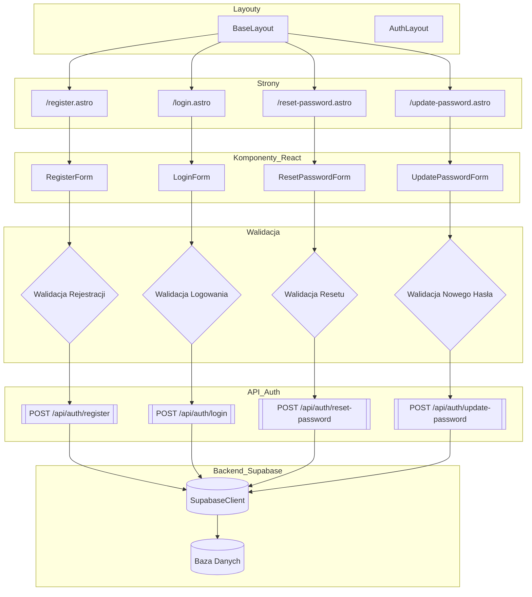

<architecture_analysis>

1. Komponenty wymienione w dokumentacji:
   - Layouty: BaseLayout, AuthLayout
   - Elementy wspólne: AuthHeader, UserMenu
   - Formularze React: RegisterForm, LoginForm, ResetPasswordForm, UpdatePasswordForm
   - Walidacja: schematy Zod (walidacja rejestracji, logowania, resetu, update)
   - API endpoints: register.ts, login.ts, reset-password.ts, update-password.ts
   - Klient Supabase: supabaseClient
2. Główne strony Astro:
   - /register.astro → RegisterForm
   - /login.astro → LoginForm
   - /reset-password.astro → ResetPasswordForm
   - /update-password.astro → UpdatePasswordForm
3. Przepływ danych:
   - Użytkownik wchodzi na stronę Astro (SSR w BaseLayout)
   - Strona renderuje odpowiedni komponent React (formularz)
   - Formularz wykonuje walidację client-side (Zod)
   - Po poprawnej walidacji wysyła żądanie POST do API endpoint
   - API endpoint używa supabaseClient do komunikacji z bazą danych
   - Odpowiedź zwracana jest do komponentu, który wyświetla komunikat lub przekierowuje
4. Funkcjonalność komponentów:
   - BaseLayout: wrapper publicznych stron z headerem i footerem
   - AuthLayout: wrapper stron chronionych, z dodatkowym AuthHeader i UserMenu
   - AuthHeader: nagłówek w trybie zalogowanym
   - UserMenu: dropdown z opcjami konta i wylogowania
   - RegisterForm: zbiera dane, waliduje i rejestruje użytkownika
   - LoginForm: zbiera dane, waliduje i loguje użytkownika
   - ResetPasswordForm: zbiera email i generuje link resetu hasła
   - UpdatePasswordForm: przyjmuje token i nowe hasło, aktualizuje je
   - SupabaseClient: komunikuje się z backendem Supabase
     </architecture_analysis>

<mermaid_diagram>

</mermaid_diagram>
